# SambaEmergencyResponseAgents Crew

Welcome to the EmergencyResponseAgents project, powered by [SambaNova API](https://sambanova.ai/) and [crewAI](https://crewai.com). This project is part of the SambaNova's [Lightning Fast AI Hackathon](https://sambanova.devpost.com/?ref_feature=challenge&ref_medium=your-open-hackathons&ref_content=Submissions+open) on [Devpost](https://devpost.com/).

## About Team AI Hounders
We are passionate tech enthusiasts caught in the eye of the GenAI storm, turning the winds of change into opportunities for innovation and impact. In our free time, we enjoy rock hounding - searching for minerals, gems and fossils in nature.

* [Divya Chandana](https://www.linkedin.com/in/divya-chandana-75b27438/)
* [Pranava Shashank P](https://www.linkedin.com/in/pranavashashank/)

`AI Hounders = Gen[AI] + Rock [Hounders]`

## Project Brief
The **Emergency Response Agents** is an agentic real-time emergency response platform, currently focused on wildfire management and evacuation coordination. The platform is highly adaptable and scalable, making it applicable to a wide range of natural disasters and emergencies, such as hurricanes, earthquakes, and floods. Its core objective is to deliver instant, accurate, and actionable guidance to rescue teams and civilians, enabling them to respond effectively during critical moments when lives and property are at stake.

The platform's ability to provide real-time situational awareness is pivotal in emergency scenarios. By leveraging SambaNova's advanced RDU-powered systems instead of traditional GPU-based architectures, it achieves unprecedented speed and efficiency in processing emergency data. Through the integration of the SambaNova API, the CrewAI framework, and NASA's Earth Observatory Natural Event Tracking (EONET) API, the system processes live data on wildfire locations, magnitudes, weather conditions, and spread patterns. This data is then synthesized to offer critical situational insights. The use of SambaNova's Llama 3.2 vision models further enhances its capabilities, enabling precise analysis of satellite imagery to track wildfire progression and assess impacts. With a structured data architecture that includes evacuation routes, safe zones, and high-risk areas, the platform ensures timely, data-driven decision-making. Its modular design and feedback loops enable continuous refinement of assessments, making it a robust and adaptive tool for managing emergencies.

## Project Demo Video
https://www.loom.com/share/210ae8483d5a432db1ea6f93105eec69

## About Team AI Hounders
We are passionate tech enthusiasts caught in the eye of the GenAI storm, turning the winds of change into opportunities for innovation and impact. In our free time, we enjoy rock hounding - searching for minerals, gems and fossils in nature.

* [Divya Chandana](https://www.linkedin.com/in/divya-chandana-75b27438/)
* [Pranava Shashank P](https://www.linkedin.com/in/pranavashashank/)

## Context Diagram


## Agent Flow Diagram
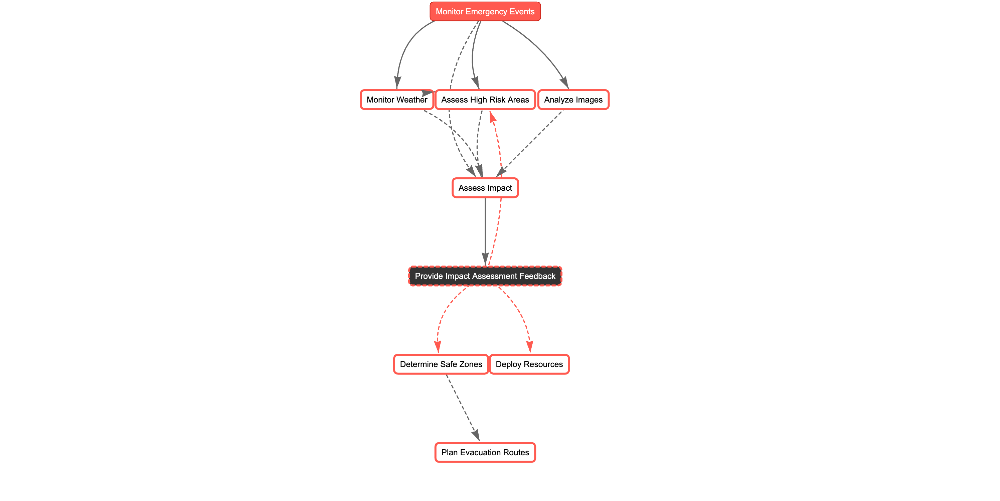

### Detailed Agent Flow Diagram


Note - Multiple Llama models were used to overcome the rate limits of the SambaNova APIs.

## Screenshots of the outputs
[PDF]() of the streamlit output:


#### Agents interacting with each other


#### Emergency Response System
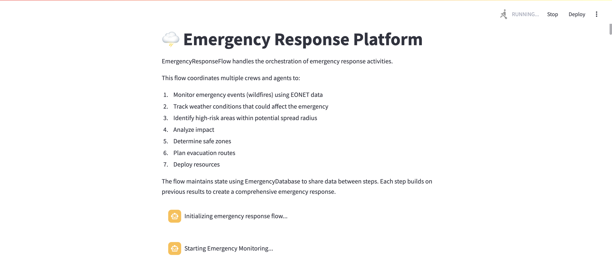

#### Event Monitoring
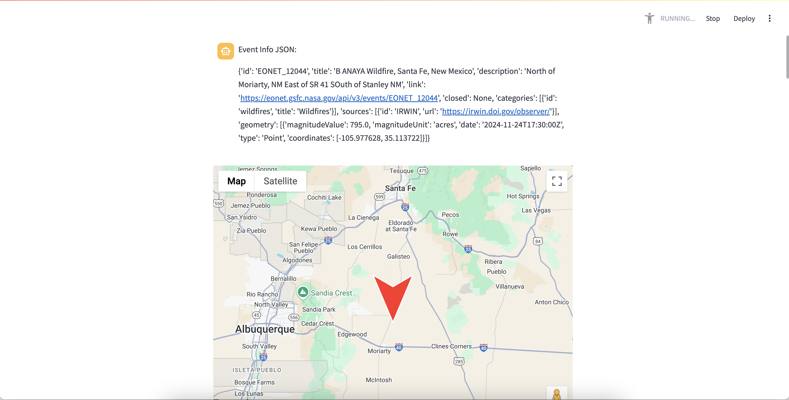

#### Weather Monitoring
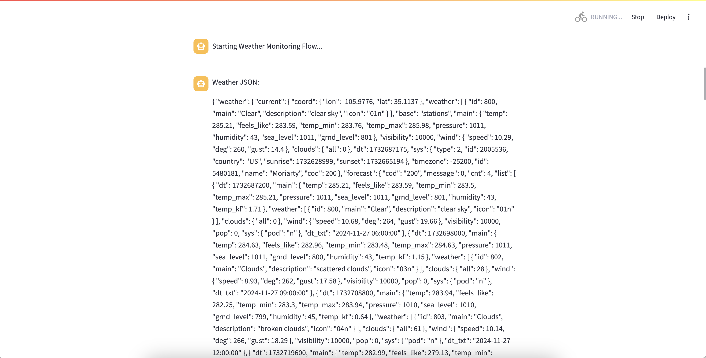

#### High Risk Zones Assessment
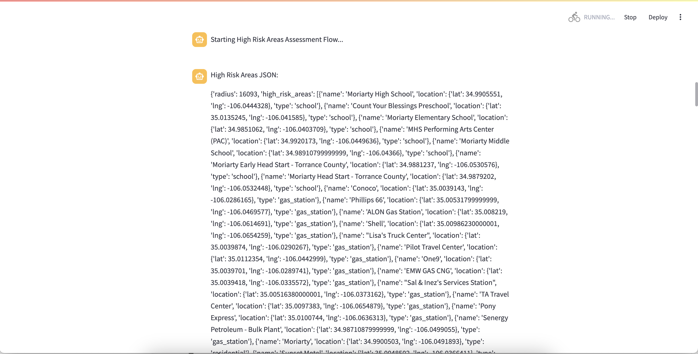
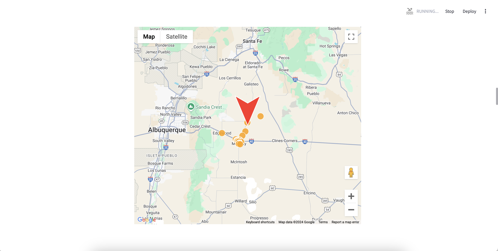

#### Image Analysis
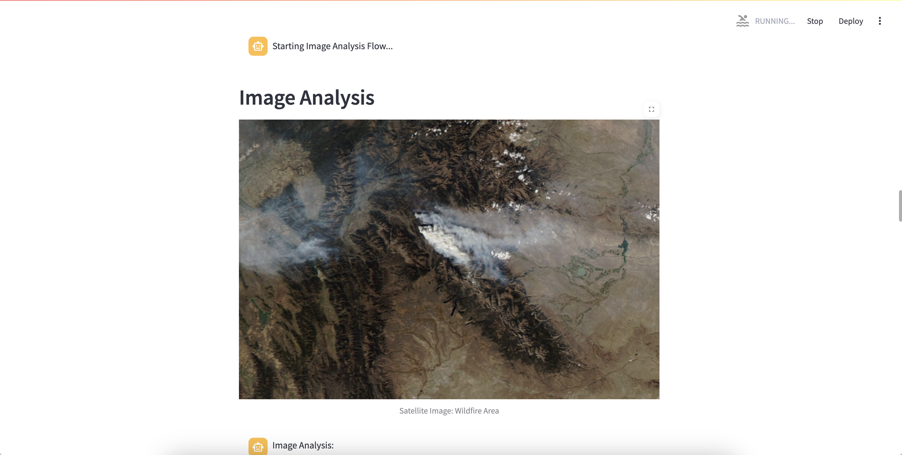
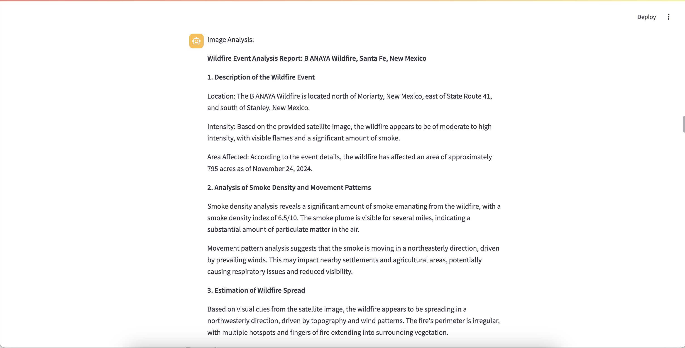

#### Impact Analysis
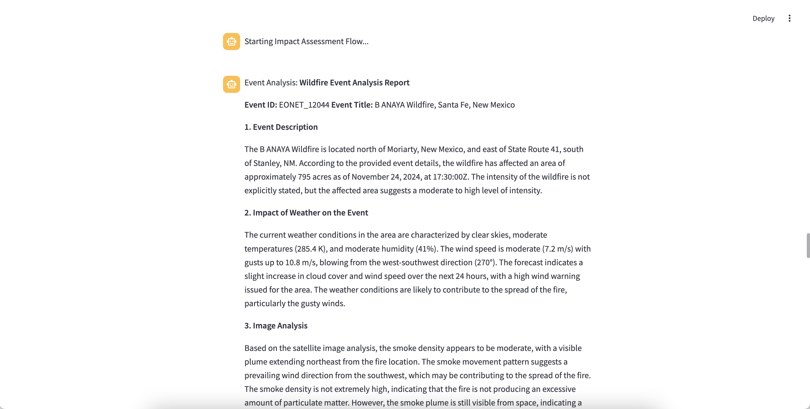
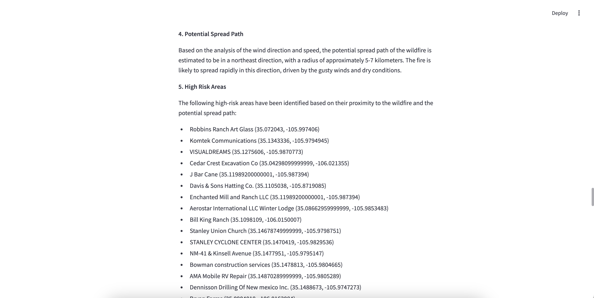

#### Human in the Loop (Take input from console)

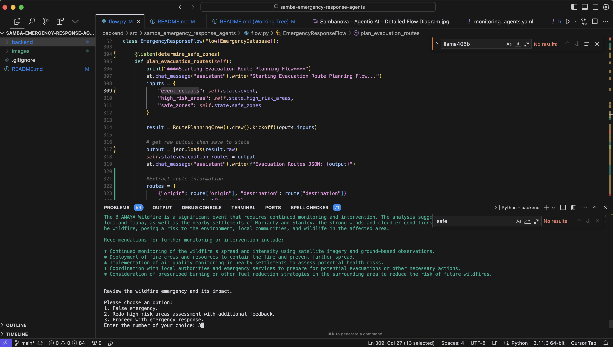

#### Safe Zone Assessment
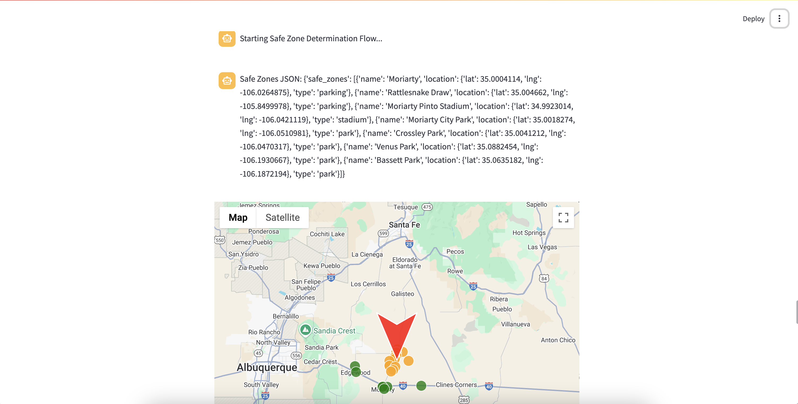

#### Resource Deployment
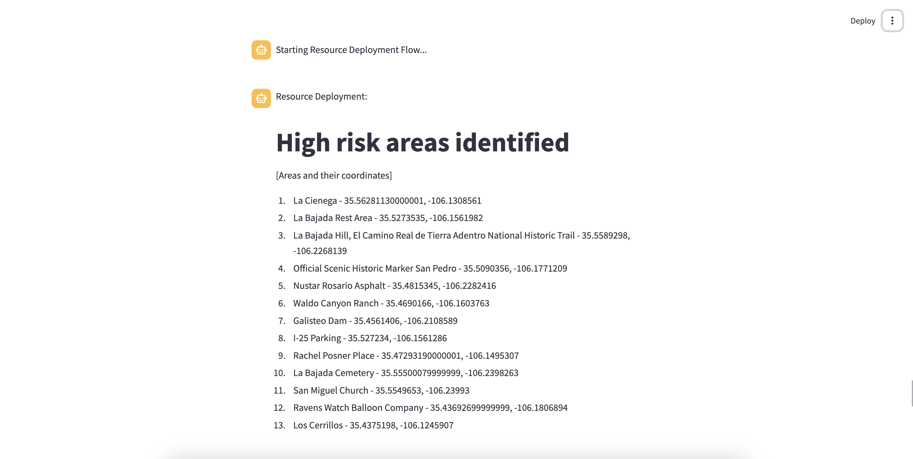
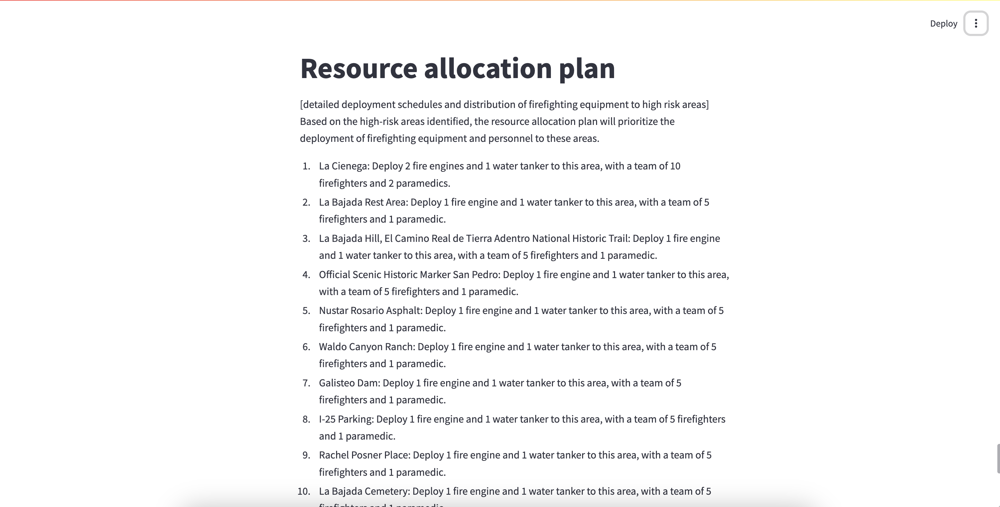
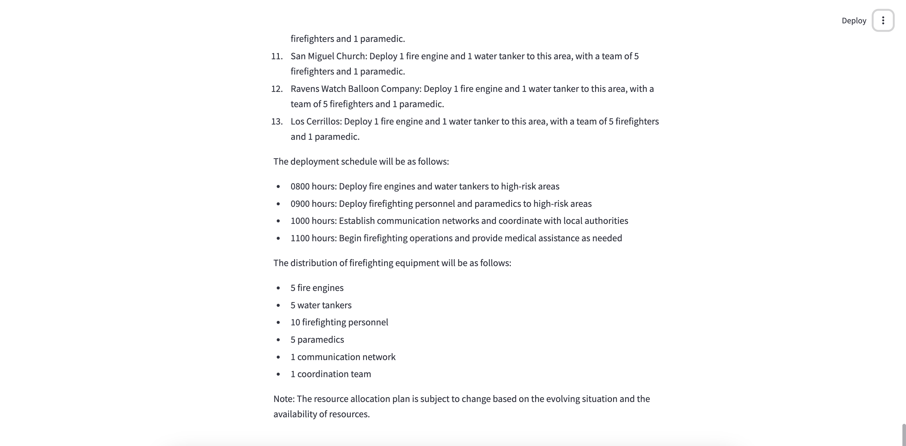

#### Evacuation Route Planning


## Comparing the platform on SambaNova APIs vs VertextAI APIs
Note - On both the APIs, Llama models were used
In Progress


## GenAI Models Used
- SambaNova's 
  - Llama 3.2 vision - 11b, 90b 
  - Llama 3.1 - 8b, 70b, 405b
- VertexAI's (for comparing performance with SambaNova's models)
  - Llama 3.2 vision - 11b, 90b
  - Llama 3.1 - 8b, 70b, 405b

## References
- NASA.Gov [EONET API](https://eonet.gsfc.nasa.gov/docs/v2.1)
- OpenWeatherMap's [API](https://openweathermap.org/api)
- Wildfire Satellite Imagery NASA.Gov [Earth Observatory](https://earthobservatory.nasa.gov/images/event/152498/2024-fires-in-the-northern-hemisphere)
- SambaNova's [API](https://docs.sambanova.ai/api-reference/)
- crewAI's [website](https://crewai.com/)
- Streamlit's [website](https://streamlit.io/)

## Agent Outputs
- Impacted Event : [event.json](https://github.com/ai-hounders/samba-emergency-response-agents/blob/main/backend/event.json)
- Weather in Impacted Area: [weather.json](https://github.com/ai-hounders/samba-emergency-response-agents/blob/main/backend/weather.json)
- High Risk Areas: [high_risk_places.json](https://github.com/ai-hounders/samba-emergency-response-agents/blob/main/backend/high_risk_places.json)
- Safe Zones: [safe zones](https://github.com/ai-hounders/samba-emergency-response-agents/blob/main/backend/safe_zones.json)
- Evacuation Routes: [evacuatoin](https://github.com/ai-hounders/samba-emergency-response-agents/blob/main/backend/evac_routes.json)
- Event Impact Analysis: [event impact analysis](https://github.com/ai-hounders/samba-emergency-response-agents/blob/main/backend/event_impact_analysis.md)
- Satellite Image Analysis: [event image analysis](https://github.com/ai-hounders/samba-emergency-response-agents/blob/main/backend/image_analysis.md)
- Resource Allocation Plan : [resource allocation](https://github.com/ai-hounders/samba-emergency-response-agents/blob/main/backend/resource_deployment.md)


## Installation

Ensure you have Python >=3.10 <=3.13 installed on your system. This project uses [UV](https://docs.astral.sh/uv/) for dependency management and package handling, offering a seamless setup and execution experience.

First, if you haven't already, install uv:

```bash
pip install uv
```

Install CrewAI

Install the main CrewAI package with the following command:

```bash
pip install crewai
```

You can also install the main CrewAI package and the tools package that include a series of helpful tools for your agents:

```bash
pip install 'crewai[tools]'
```

Upgrade CrewAI

To upgrade CrewAI and CrewAI Tools to the latest version, run the following command

```bash
pip install --upgrade crewai crewai-tools
```

Next, navigate to your project directory and install the dependencies:

(Optional) Lock the dependencies and install them by using the CLI command:
```bash
crewai install
```

Install Streamlit

```bash
pip install streamlit
```

### Customizing

Create a .env file with `SERPER_API_KEY` and `SAMBANOVA_API_KEY` variables.

- Modify `src/samba_emergency_response_agents/config/agents.yaml` to define your agents
- Modify `src/samba_emergency_response_agents/config/tasks.yaml` to define your tasks
- Modify `src/samba_emergency_response_agents/crew.py` to add your own logic, tools and specific args
- Modify `src/samba_emergency_response_agents/flow.py` to add flow logic to orchestrate your crews with better control

## Running the Project

To kickstart your crew of AI agents and begin task execution, run this from the root folder of your project:

```bash
$ cd backend #Since repo is segregated into frontend and backend
$ source .venv/bin/activate 
$ streamlit run src/samba_emergency_response_agents/flow.py
```

This command initializes the EmergencyResponseFlow, assembling the crews agents and assigning them tasks as defined in your configuration.
