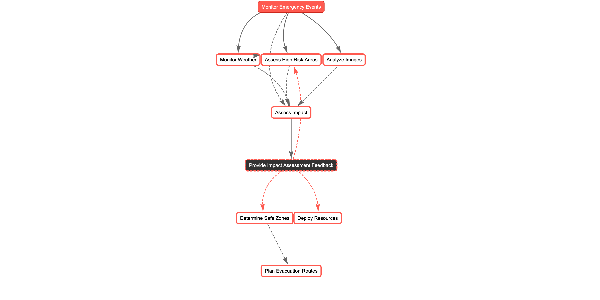

# SambaEmergencyResponseAgents Crew

Welcome to the EmergencyResponseAgents project, powered by [SambaNova API](https://sambanova.ai/) and [crewAI](https://crewai.com). This project is part of the SambaNova's [Lightning Fast AI Hackathon](https://sambanova.devpost.com/?ref_feature=challenge&ref_medium=your-open-hackathons&ref_content=Submissions+open) on [Devpost](https://devpost.com/).

The Emergency Response Agents is a real-time emergency response platform, currently focused on wildfire management and evacuation coordination. The platform can be easily scalable to other natural disasters and emergencies like hurricanes, earthquakes, etc. By leveraging the SambaNova API and crewAI framework, along with NASA's Earth Observatory Natural Event Tracking (EONET) API for monitoring active wildfires and natural events, it processes live emergency data including location, magnitude, and spread patterns to provide critical situational awareness. The system maintains information about evacuation routes, safe zones, and high-risk areas through a comprehensive data structure that includes geographical coordinates and detailed location metadata. Additionally, it analyzes satellite imagery using SambaNova's Llama 3.2 vision models to infer and track wildfire progression and impact.

On the frontend, the platform uses Streamlit to create an interactive dashboard that visualizes the emergency data on Google Maps. It tracks wildfire events from EONET with real-time updates on their coordinates, magnitude (820 acres), and status, maps out evacuation routes between origins and destinations, identifies safe zones across different categories, and highlights high-risk areas within a specified radius. This integration of NASA's EONET data feed, real-time data processing, satellite imagery analysis, and spatial visualization provides emergency responders and affected communities with actionable intelligence for better decision-making during crisis situations.

## Agent Flow Diagram



## About Team AI Hounders
We are passionate tech enthusiasts caught in the eye of the GenAI storm, turning the winds of change into opportunities for innovation and impact. In our free time, we enjoy rock hounding - searching for minerals, gems and fossils in nature.

* [Pranava Shashank P](https://www.linkedin.com/in/pranavashashank/)
* [Divya Chandana](https://www.linkedin.com/in/divya-chandana-75b27438/)

`AI Hounders = Gen[AI] + Rock [Hounders]`


## References
- NASA.Gov [EONET API](https://eonet.gsfc.nasa.gov/docs/v2.1)
- OpenWeatherMap's [API](https://openweathermap.org/api)
- Wildfire Satellite Imagery NASA.Gov [Earth Observatory](https://earthobservatory.nasa.gov/images/event/152498/2024-fires-in-the-northern-hemisphere)
- SambaNova's [API](https://docs.sambanova.ai/api-reference/)
- crewAI's [website](https://crewai.com/)
- Streamlit's [website](https://streamlit.io/)

## GenAI Models Used
- SambaNova's 
  - Llama 3.2 vision - 11b, 90b 
  - Llama 3.1 - 8b, 70b, 405b
- VertexAI's (for comparing performance with SambaNova's models)
  - Llama 3.2 vision - 11b, 90b
  - Llama 3.1 - 8b, 70b, 405b

## Installation

Ensure you have Python >=3.10 <=3.13 installed on your system. This project uses [UV](https://docs.astral.sh/uv/) for dependency management and package handling, offering a seamless setup and execution experience.

First, if you haven't already, install uv:

```bash
pip install uv
```

Install CrewAI

Install the main CrewAI package with the following command:

```bash
pip install crewai
```

You can also install the main CrewAI package and the tools package that include a series of helpful tools for your agents:

```bash
pip install 'crewai[tools]'
```

Upgrade CrewAI

To upgrade CrewAI and CrewAI Tools to the latest version, run the following command

```bash
pip install --upgrade crewai crewai-tools
```

Next, navigate to your project directory and install the dependencies:

(Optional) Lock the dependencies and install them by using the CLI command:
```bash
crewai install
```

Install Streamlit

```bash
pip install streamlit
```

### Customizing

Create a .env file with `SERPER_API_KEY` and `SAMBANOVA_API_KEY` variables.

- Modify `src/samba_emergency_response_agents/config/agents.yaml` to define your agents
- Modify `src/samba_emergency_response_agents/config/tasks.yaml` to define your tasks
- Modify `src/samba_emergency_response_agents/crew.py` to add your own logic, tools and specific args
- Modify `src/samba_emergency_response_agents/flow.py` to add flow logic to orchestrate your crews with better control

## Running the Project

To kickstart your crew of AI agents and begin task execution, run this from the root folder of your project:

```bash
$ cd backend #Since repo is segregated into frontend and backend
$ source .venv/bin/activate 
$ python flow.py
```

This command initializes the EmergencyResponseFlow, assembling the crews agents and assigning them tasks as defined in your configuration.

This example, unmodified, will run the create a `report.md` file with the output of a research on LLMs in the root folder.

## Understanding Your Crew

The samba-emergency-response-agents Crew is composed of multiple AI agents, each with unique roles, goals, and tools. These agents collaborate on a series of tasks, defined in `config/tasks.yaml`, leveraging their collective skills to achieve complex objectives. The `config/agents.yaml` file outlines the capabilities and configurations of each agent in your crew.

